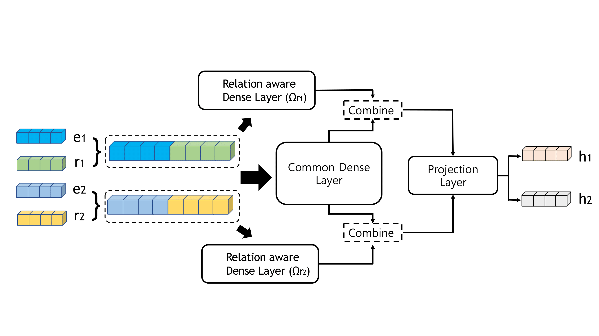

# ComDensE

 "Combined Dense Embedding of Relation-aware and Common Features for Knowledge Graph Completion" <br>
 International Conference on Patter Recognition, 2022, Accepted

<p align="center">
  
</p>

## model list : comdense, shared_only, multilayer(shared_only)

```bash
 python main.py --model "model" --data "dataset_name" --name "name"
```

### download trained models : [Downloads](https://drive.google.com/drive/folders/1GeGdZgnanNYbEwc_rqMQM71Lv16M5F0P?usp=sharing)

## evaluation) : download pretrained models from google drive and save to directory ./torch_saved
```bash 
 python main.py --model comdense --width 2 --restore --epoch 0 --name ComDensE_FB15k-237 --data FB15k-237
 python main.py --model comdense --width 100 --restore --epoch 0 --name ComDensE_WN18RR --data WN18RR
 ```

## train example)
```bash
 python main.py --model comdense --width 2 --data FB15k-237 --name ComDensE_FB15k-237
 python main.py --model shared --width 100 --data WN18RR --name SharedDensE_100_WN18RR
 python main.py --model multilayer --depth 4 --data FB15k-237 --name MultiLayer_4_FB15k-237
```

## Citation
If you use any part of this code and pretrained weights for your own purpose, please cite our [paper](https://arxiv.org/pdf/2206.14925.pdf).
```
@InProceedings{,
  title = 	 ComDensE : Combined Dense Embedding of Relation-aware and Common Features for Knowledge Graph Completion},
  author =       {Minsang Kim, Seungjun Baek},
  booktitle = 	 {Proceedings of the 26th International Conference on Pattern Recognition},
  year = 	 {2022},
  series = 	 {Proceedings of Machine Learning Research},
  month = 	 {21--25 August},
  publisher =    {IEEE},
  pdf = 	 {https://arxiv.org/pdf/2206.14925.pdf},
  abstract = 	 {Real-world knowledge graphs (KG) are mostly incomplete. The problem of recovering missing relations, called KG completion, has recently become an active research area. Knowledge graph (KG) embedding, a low-dimensional representation of entities and relations, is the crucial technique for KG completion. Convolutional neural networks in models such as ConvE, SACN, InteractE, and RGCN achieve recent successes. This paper takes a different architectural view and proposes ComDensE which combines relation-aware and common features using dense neural networks. In the relation-aware feature extraction, we attempt to create relational inductive bias by applying an encoding function specific to each relation. In the common feature extraction, we apply the common encoding function to all input embeddings. These encoding functions are implemented using dense layers in ComDensE. ComDensE achieves the state-of-the-art performance in the link prediction in terms of MRR, HIT@1 on FB15k-237 and HIT@1 on WN18RR compared to the previous baseline approaches. We conduct an extensive ablation study to examine the effects of the relation-aware layer and the common layer of the ComDensE. Experimental results illustrate that the combined dense architecture as implemented in ComDensE achieves the best performance.}
  }
